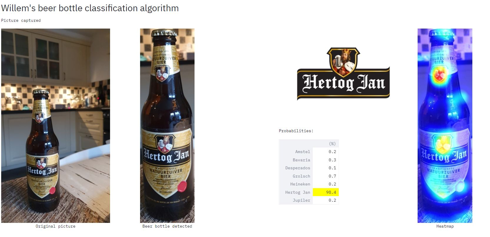
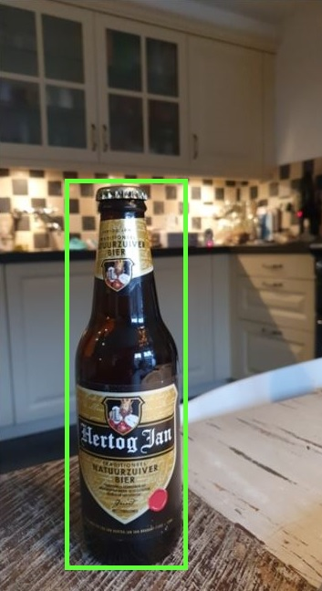
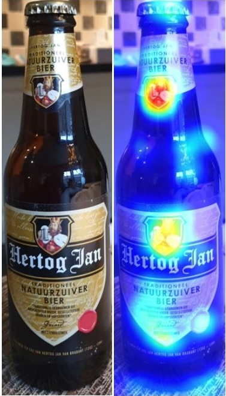

# BeerCooler

As a data scientist, it is sometimes very hard to explain clearly to non-data-minded people what you do for living. I have friends who literally don't have a clue what I'm doing all day at the office. For those people, I'm working on a new project; a beer-cooling whisky barrel that is able to communicate with it's users about the beers that are in it. For example, when someone picks the last bottle out of the barrel, a siren should go off to trigger the host to refill the barrel with new beers. Ofcourse, a lot of other functions are possible to (an ambilight based on the beer brand, temperature checks, etc.). This way, I hope to let them understand what cool new possibilities become available due to new data science (Deep Learning) techniques. 

<picture of barrel>

To let the barrel know what's in it, I've placed a Raspberri Pi with camera on the barrel and wrote some computer vision scripts to process the images. I wanted to make the scripts reproducable, so that you can use it to discuss the possibilities of data science/AI with your friends, too. And because I don't expect you to build a beer-booling whisky barrel yourselves, I tried to make it a little more accessible. Therefore, I created some scripts that do the magic (beer bottle detection, beer brand classification) and can easily be combined with your own phone camera.



## Structure

The repo consists of the following files:
- streamlit_camera.py (a script that let you use your phone camera as input for detecting and classifying beers)
- streamlit_upload.py (same magic as above, but with an upload button to upload images from your pc)
- beerchallenge_resnet50_7brands.pth (the beer brand classification model)
- get_image.py (some functions to get the images from the camera)
- object_detection.py (some beer detection related functions)
- beer_classification.py (some beer brand classification related functions)
- train_beermodel.py (some functions to train your own beer model, not required for running the app, but it can be handy of you want to create your own beer model or want to add other beer brands)
- requirements.txt (where the required packages can be found)
- data folder (images where model was trained upon, not required for running the app)
- latest_picture folder (where the latest processed picture (+ results) is stored)
- logo folder (consists the logo's of the brands, just for visualization)
- checkpoints (consists some other files, not really relevant for now)

## How to get started

Before diving into the details, let me explain how you can get started.

1) Clone this repo, create a virtual environment and install dependencies
2) Download the IP Webcam app on your phone (tested on Android). If active, this app streams your camera to your wifi network, so that's it becomes accessible for other devices within your wifi network. 
3) In the IP Webcam app, press 'Start server' to start streaming your phone camera. Write down the (http, not https) IPv4 address (http://xxx.xxx.xxx.xxx:xxxx). 
4) In cmd, activate your virtual environment, move to the correct folder and type 'streamlit run streamlit_camera.py http://xxx.xxx.xxx.xxx:xxxx'. Now, a web page should pop up with the app. 
5) If you want to upload a picture (in stead of using your camera), you can forget step 2 and 3 and type 'streamlit run streamlit_upload.py'

## How does it work?

All code is written in Python. I've used PyTorch for creating and adjusting the Neural Networks for the object detection, image classification and the GradCAM (heatmaps). To visualise this in an app, I've used Streamlit, which is a fantastic way to create apps with just a few lines of Python code. 

I want to highlight a few elements; the detection of the beer bottle, the classification of the beer brand, Streamlit and how to train your own beer classification model?

### Beer detection

For the detection of beer bottles, I've used a pretrained Faster-RCNN Deep Learning network, which is trained to detect almost 80 different objects (including bottles). Because this was already available, I just reused it to get started very quickly. Check out [this link](https://debuggercafe.com/faster-rcnn-object-detection-with-pytorch/) for some extra info about the model. Because I'm only interested in bottles, I've made some small adjustments to make sure that other objects are ignored. These can be found in object_detection.py.

If an image consists two (or more) beer bottles objects, the object with the highest probability (of being a bottle, according to the object detection model) is processed. 


### Beer classification

The beer classification model is based on a pretrained Resnet50 architecture, that I retrained on (a couple hundred of) Google Image pictures of beer barrels. See below ('How to train your own model?') for more information how I trained the model. 

The *beer_classification* function does two things: identifying the beer brand and producing a (GradCAM) heatmap. This heatmap will help you understand how the model came to its conclusion; which pixels make that the result is as it is? For example, in the picture below you see that the logos of Hertog Jan are coloured red and yellow; this means that these pixels have high impact ons the prediction. The other parts of the image are blue, which indicate that they have limited impact on the outcome. For more information about GradCAM, check out [this page](https://medium.com/@stepanulyanin/implementing-grad-cam-in-pytorch-ea0937c31e82).



### Streamlit

As I said, the deployment of the code is being done via Streamlit. This is a great way of making your Python code accessible for others. With just a few lines of code, you can deploy your models in an interactive app. If you don't know Streamlit, you should definitely check out [their site](https://www.streamlit.io/).

### How to train your own model?

If you want to train your own beer classification model (and who not want to do this??), you can reuse the functions in train_beermodel.py. 

The classification model was trained on images of beer bottles that I've downloaded from Google Images. You can use the [Chrome extention 'Download All Images'](https://chrome.google.com/webstore/detail/download-all-images/ifipmflagepipjokmbdecpmjbibjnakm) for downloading images from Google. After downloading images, the folder structure should be as followed:
```
.
+--data
|  +--original
|       +--amstel
|          +--filename_amstel_image1.jpg (etc)
|       +--heineken (or any other beer brand)
|          +--filename_heineken_image1.jpg (etc)
```

I've created some functions to make the training as easy as possible, you can find them in train_beermodel.py. First split the dataset in a training and a validation dataset by using the *split_trainval* function. This function just creates a new folder structure where two new folders are created; train and val. After using this function, the folder structure should be as followed (ofcourse, you can do the restructuring of the folders by hand, too):
```
.
+--data
|  +--original
|     +--train
|        +--amstel
|        +--heineken (or any other beer brand)
|        (etc)
|     +--val
|        +--amstel
|        +--heineken (or any other beer brand)
|        (etc)
```
Now we've downloaded the images and put them in the right folder structure, the 2nd step is to crop the images, such that only the beer bottles are on the images. This is helpful, because the background (and other irrelevant objects) on the image can be misleading for the image classification model. To do this, I've created the function *crop_beers_to_folder*. This works ofcourse by using the same object detection model as described above, but with some small adjustments. One of the adjustments is that if there are multiple bottles on 1 image, the function crops the image so that all bottles are on the image. The results can be written in a new folder, in my case this was 'detected'. The folder structure should now be:
```
.
+--data
|  +--original
|  +--dectected
|     +--train
|     +--val
```
The final step is to actually train the model based on the cropped beer images. I've used a pretrained Resnet50 architecture that can be downloaded via PyTorch (modes.Resnet50) You can use the *train_beermodel* function. Ofcourse, there are many (many) parameters that can be adjusted in the architecture (learning rate, transformations, weight decay, etc.), but for now, I not dove into details here and just wanted to get it running ASAP. But I'm pretty sure that the accuracy of the model can be improved if you spend some time here. 

## Next steps
