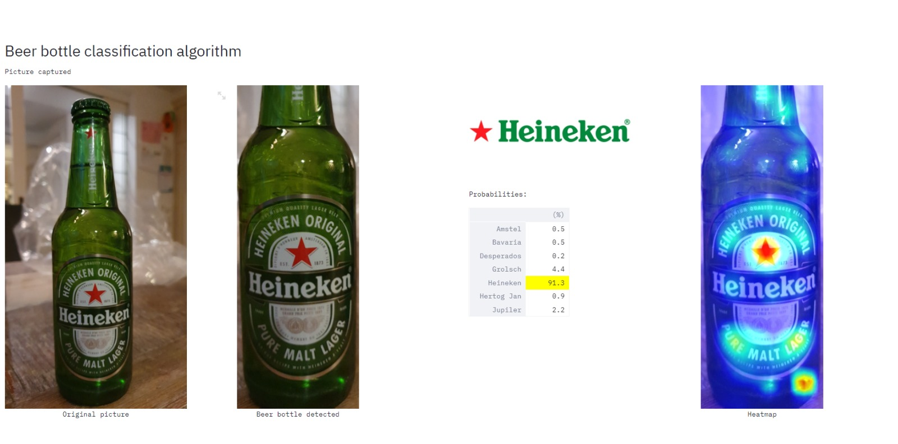

# BeerCooler

As a data scientist, it is sometimes very hard to explain clearly to non-data-minded people what you do for living. I have friends who literally don't have a clue what I'm doing all day at the office. For those people, I'm working on a new project; a beer-cooling whisky barrel that is able to communicate with it's users about the beers that are in it. For example, when someone picks the last bottle out of the barrel, a siren should go off to trigger the host to refill the barrel with new beers. Ofcourse, a lot of other functions are possible to (an ambilight based on the beer brand, temperature checks, etc.).

<picture of barrel>

To let the barrel know what's in it, I've placed a Raspberri Pi with camera on the barrel and wrote some computer vision scripts to process the images. I wanted to make the scripts reproducable, so that you can use it to discuss the possibilities of data science/AI with your friends, too. And because I don't expect you to build a beer-booling whisky barrel yourselves, I tried to make it a little more accessible. Therefore, I created some scripts that do the magic (beer bottle detection, beer brand classification) and can easily be combined with your own phone camera.

## Structure

The repo consists of the following files:
- streamlit_camera.py (a script that let you use your phone camera to detect and classify beers)
- streamlit_upload.py (same magic as above, but with an upload button to upload images from your pc)
- beerchallenge_resnet50_7brands.pth (the beer brand classification model)
- get_image.py (some functions to get the images from the camera)
- object_detection.py (some beer detection related functions)
- beer_classification.py (some beer brand classification related functions)
- train_beermodel.py (some functions to train your own beer model, not required for running the scripts, but it can be handy of you want to create your own beer model or want to add other beer brands)
- requirements.txt (where the required packages can be found)
- logo folder (consists the logo's of the brands, just for visualization)
- checkpoints (consists some other files, not really relevant for now)

## How to get started

Before diving into the details, let me explain how you can get started.

- Clone this repo, create a virtual environment and install dependencies
- Download the IP Webcam app on your phone (tested on Android). If active, this app streams your camera to your wifi network, so that's it becomes accessible for other devices within your wifi network. 
- In the IP Webcam app, press 'Start server' to start streaming your phone camera. Write down the (http, not https) IPv4 address (http://xxx.xxx.xxx.xxx:xxxx). 
- In cmd, activate your virtual environment, move to the correct folder and type 'streamlit run streamlit_camera.py http://xxx.xxx.xxx.xxx:xxxx'

Now, a web page should pop up with the app. 

## How does it work?
